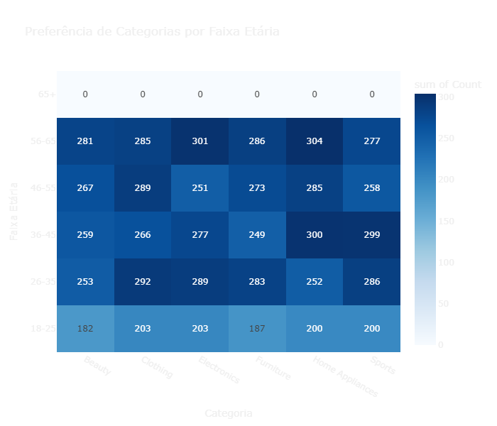
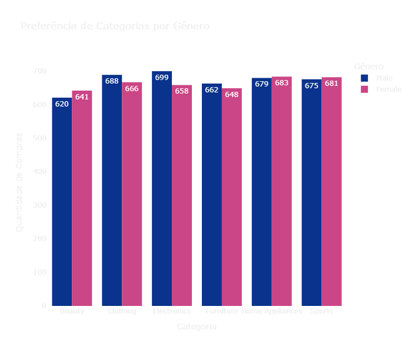
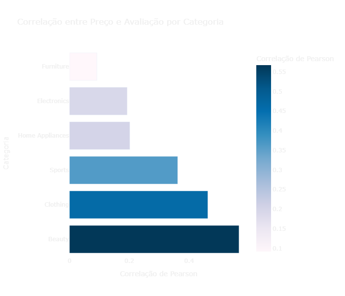
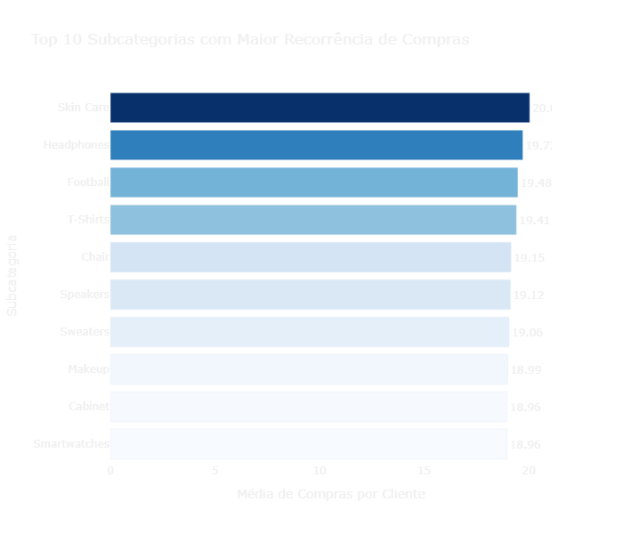
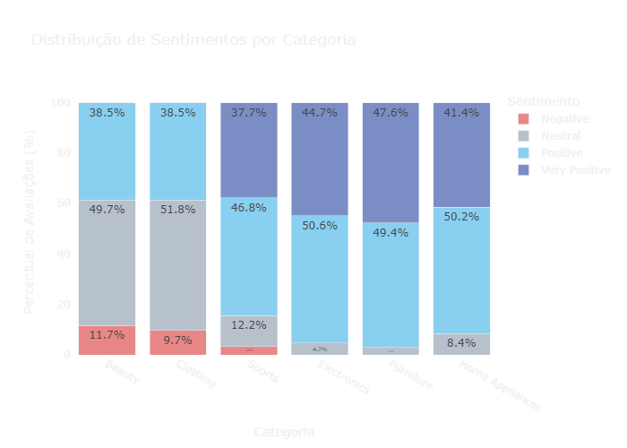
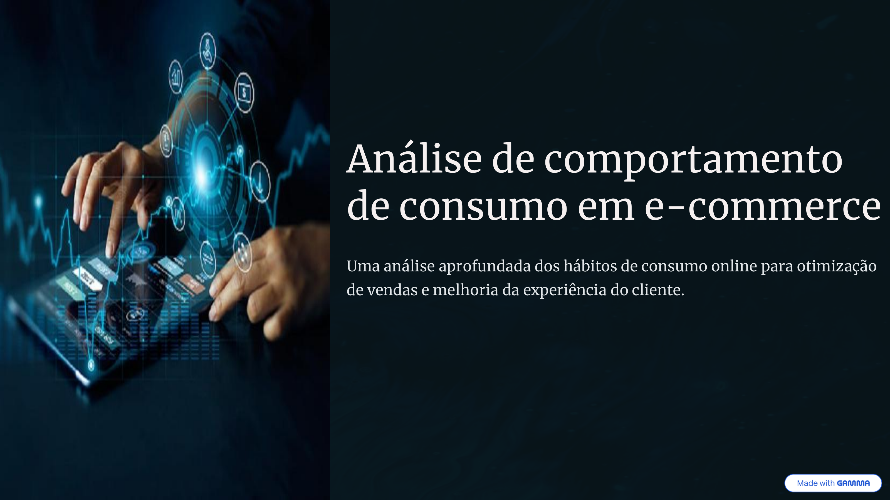

# 📊 Projeto Final - Análise de Dados de E-commerce

Este projeto foi desenvolvido como parte da apresentação final do **Módulo 3 de Python** do curso de **Data Analytics**. 
O objetivo principal é aplicar técnicas de análise de dados em um contexto real, utilizando ferramentas aprendidas ao longo do módulo.

---

## 📚 Sumário

- [🎯 Objetivos](#-objetivos)  
- [📁 Dataset](#-dataset)  
- [🛠️ Ferramentas Utilizadas](#️-ferramentas-utilizadas)  
- [🔍 Etapas da Análise](#-etapas-da-análise)  
- [📊 Visualizações e Insights](#-visualizações-e-insights)  
- [🧠 Conclusão e Recomendações](#-conclusão-e-recomendações)  
- [👩‍💻 Autora](#-autora)

---

## 🎯 Objetivos

Análise de hábitos de consumo e padrões de comportamento dos clientes em um e-commerce, com foco em:

- 🔍 **Analisar Comportamentos**
- 🎯 **Segmentar Público**
- 💰 **Otimizar Vendas**
- 🛍️ **Melhorar a Experiência do Cliente**

---

## 📁 Dataset

O dataset `refined_ecommerce_product_data.csv` contém:

| Coluna             | Descrição                                |
|--------------------|--------------------------------------------|
| `Product_ID`       | Identificador único do produto             |
| `Product_Name`     | Nome do produto                            |
| `Category`         | Categoria principal (ex: Clothing)         |
| `Sub_Category`     | Subcategoria (ex: Pants, Sofa, Shoes)      |
| `Price`            | Preço do produto (USD)                     |
| `Customer_Age`     | Idade do cliente                           |
| `Customer_Gender`  | Gênero do cliente (Male/Female)            |
| `Purchase_History` | Compras anteriores do cliente              |
| `Review_Rating`    | Avaliação do produto (1 a 5 estrelas)      |

---

## 🛠️ Ferramentas Utilizadas

- 
- **Pandas**: Manipulação e análise de dados  
- **Plotly**: Gráficos interativos e visualizações  
- **Jupyter Notebook**: Documentação e execução do projeto

---

## 🔍 Etapas da Análise

1. **Análise Exploratória (EDA)**
   - Limpeza, estruturação e inspeção dos dados.
2. **Estatísticas Descritivas**
   - Análise de preços, idades, avaliações, histórico de compras.
3. **Visualizações Interativas**
   - Categorias, gêneros, subcategorias, correlação de variáveis, análise de Sentimentos.
4. **Conclusão e Recomendações Estratégicas**

---

## 📊 Visualizações e Insights

### 📌 Preferência por Faixa Etária

- Moda domina entre 26–35 e 46–55 anos  
- Eletrônicos surpreendem no público 56–65 anos  
- Móveis e Eletrodomésticos crescem com a idade  

---

### 📌 Preferência por Gênero

- Consumo diversificado entre gêneros  
- Leve predominância feminina em Beleza e Eletrodomésticos  
- Homens consomem mais Eletrônicos e Móveis, mas com equilíbrio

---

### 📌 Correlação entre Preço e Avaliação

- Alta correlação em Roupas e Beleza (preço = qualidade percebida)  
- Baixa correlação em Móveis e Eletrônicos (durabilidade > preço)

---

### 📌 Recorrência por Subcategoria

- Subcategorias com maior fidelidade:  
  *Skin Care*, *Football*, *Headphones*, *T-Shirts*

---

### 📌 Sentimento do Cliente

- Móveis e Eletrônicos com maior índice de avaliações muito positivas  
- Beleza apresentou o maior percentual de avaliações negativas  
- Roupas têm muitas avaliações neutras — oportunidade de melhoria

---

## 🧠 Conclusão e Recomendações

### 🟢 Produto
- Aprimorar linhas de Roupas e Beleza  
- Preservar qualidade em Móveis e Eletrônicos  
- Expandir linhas similares à de Skin Care

### 🟣 Marketing
- Segmentar campanhas por faixa etária e gênero  
- Utilizar reviews positivos nas campanhas  
- Fidelizar clientes das subcategorias com alta recompra

---

## 📽 Visualize a Apresentação

A apresentação completa com os principais insights deste projeto está disponível no link abaixo:

📄 [Clique aqui para abrir a apresentação em PDF](./apresentacao/apresentacao_projeto_python.pdf)

---

## 👩‍💻 Autora

**Wilma Silva de Souza**  
🔗 [LinkedIn](https://www.linkedin.com/in/wilmasdesouza)  

